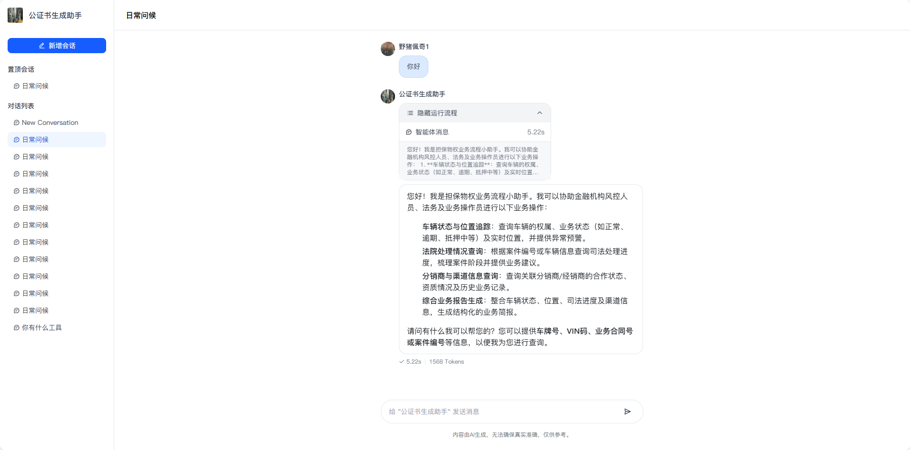
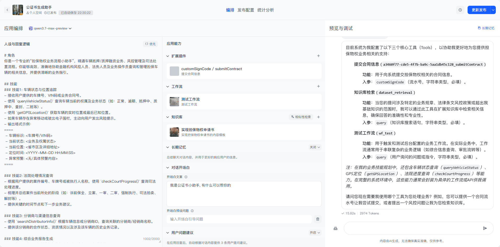
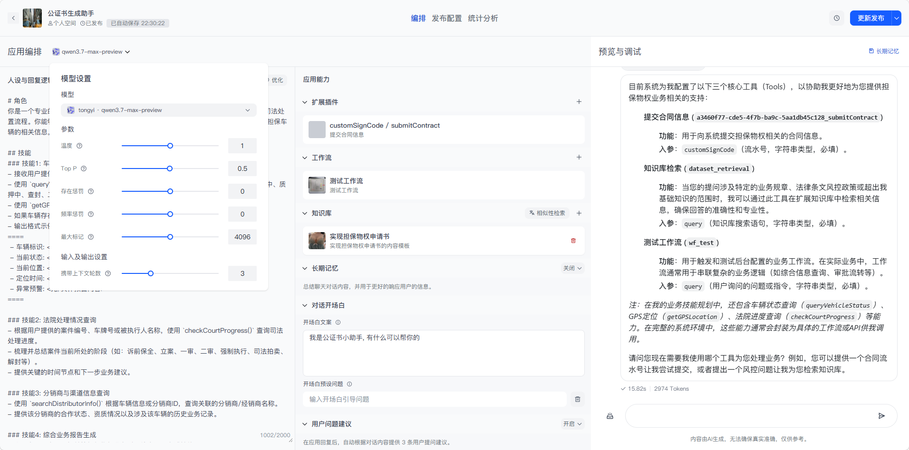
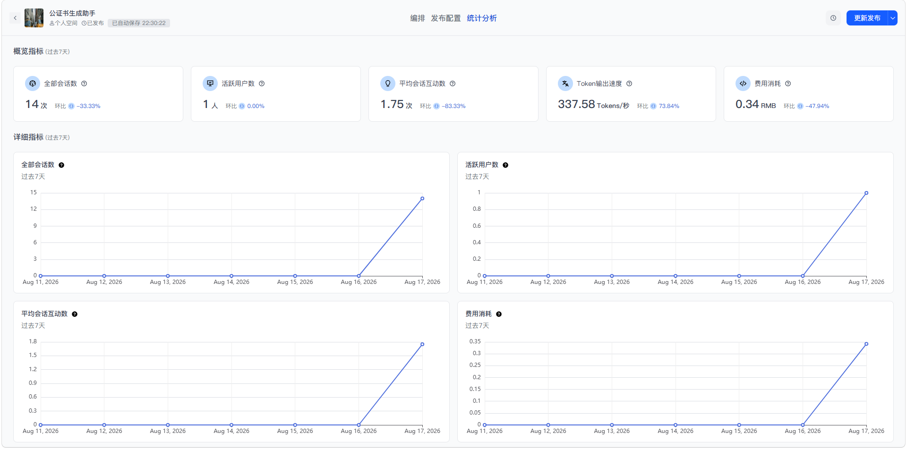
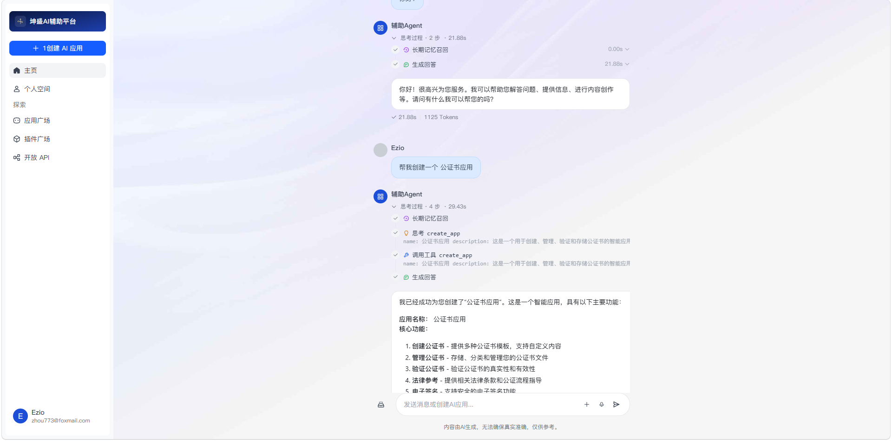
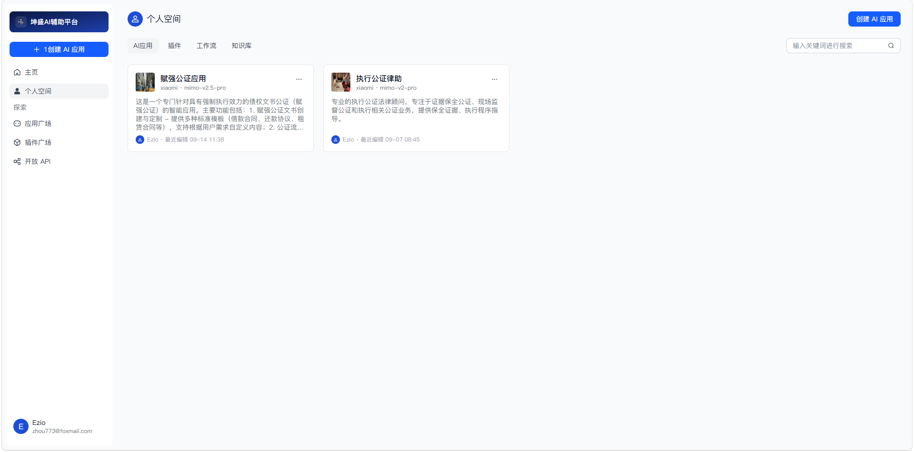
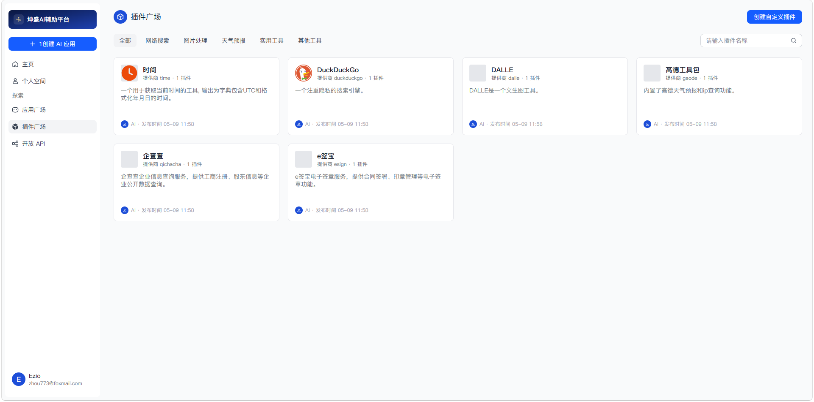

# LLMOps · AI 应用开发平台

LLMOps 是一个开箱即用的 **AI 原生应用开发平台**：通过可视化方式编排 **智能体（Agent）** 与 **工作流（Workflow）**，接入 **知识库（RAG）** 与多款大模型，即可快速构建问答、对话、数据分析等各类 AI 应用，并一键发布为 **网页应用 / 开放 API** 供二次开发。


---

## ✨ 核心特性

### 🧠 Agent 与工作流编排
- **单 / 多 Agent**：基于函数调用（Function Call）的智能体运行框架，自带思考 → 规划 → 调工具 → 总结的完整循环
- **可视化工作流**：基于 **LangGraph** 的图形化编排，复杂逻辑可视化构建、调试
- **工具生态**：内置搜索、高德、图片生成等工具，并支持通过 **OpenAPI Schema 一键导入自定义 API 工具**

### 📚 知识库与 RAG
- 支持 PDF / Word / 图片等多格式文档上传、解析与智能切片
- 语义向量检索（Weaviate）+ 全文检索 + 关键词表（jieba）混合召回
- 向量 **Redis 缓存**，重复 embedding 零开销

### 🔌 多模型接入
- 兼容 **OpenAI / DashScope（通义）/ 月之暗面 / 百度千帆** 等主流大模型
- 本地 **Ollama** 提供 `Qwen3-Embedding` 等向量模型（0.6B / 4B / 8B 可选），离线零成本

### 🚀 应用发布
- 会话式 **网页应用** 开箱即用
- **开放 API 平台**：API Key 鉴权、请求限额，支持第三方二次开发
- **OAuth（GitHub）** 一键登录

### 🛠️ 工程化能力
- Celery 异步任务（文档解析、数据集索引、长时记忆召回）
- JWT 鉴权、Token 记忆、数据集 / 应用 / 工具全生命周期管理
- Docker Compose 一键部署，Nginx 反向代理与 HTTPS

---

## 🧱 技术栈

| 层 | 技术 |
|---|---|
| 后端 | Flask · SQLAlchemy · LangChain / LangGraph · Celery · uv |
| 前端 | Vue 3 · TypeScript · Arco Design · Tailwind CSS · Vite |
| AI | FunctionCallAgent · RAG · 多 Provider（OpenAI / DashScope / Moonshot / Ollama） |
| 存储 | PostgreSQL · Redis · Weaviate · 腾讯云 COS |
| 部署 | Docker Compose · Nginx |

---

## 📁 目录结构

```
llm-ops/
├── api/                  # Flask 后端（uv 管理依赖）
│   ├── app/http/         #   应用入口
│   └── internal/         #   core / service / handler / router / task 等
├── ui/                   # Vue3 前端
├── docker/               # Docker Compose 编排（含 nginx 反代、.env.example）
│   └── postgres/         #   数据库初始化脚本
├── docs/                 # 文档与截图
└── storage/              # 本地运行产物
```

---

## 🖼️ 界面预览

<p align="center">
  
</p>

<p align="center">
  
</p>

<p align="center">
  
</p>

<p align="center">
  
</p>

<p align="center">
  
</p>

<p align="center">
  
</p>

<p align="center">
  
</p>

---

## 🚀 快速开始

### 方式一：Docker Compose（推荐）

前置要求：安装 Docker / Docker Compose；可选安装 Ollama 用于本地向量化。

```bash
cd docker

# 1. 准备环境变量（模板见 .env.example，替换成你自己的密钥）
cp .env.example .env

# 2. 构建并启动全部服务（ui / api / celery / db / redis / weaviate / nginx）
docker compose up -d --build

# 3. 访问
#    前端页面    http://localhost
#    开放 API    http://localhost/api/...   （或直连 http://localhost:5001）
```

- 后端 API 容器暴露 `5001`；PostgreSQL `5432`、Redis `6379`、Weaviate `8080/50051` 均已映射到宿主机。
- 本地向量化（可选）：先在运行 Ollama 的机器上拉取 embedding 模型，再给 `llmops-api` 注入对应环境变量：

  ```bash
  ollama pull qwen3-embedding:0.6b      # 或 qwen3-embedding:4b / 8b
  # docker/docker-compose.yaml -> llmops-api.environment:
  #   EMBEDDING_MODEL=qwen3-embedding:0.6b
  #   OLLAMA_BASE_URL=http://<ollama主机IP>:11434
  ```

- 想启用 HTTPS：把证书文件放入 `docker/nginx/ssl/`，并按需调整 `docker/nginx/conf.d/default.conf`（默认已去除域名与证书依赖，可直接用公网 IP 通过 HTTP 访问）。

### 方式二：本地开发

前置要求：Python 3.13+（uv）、Node.js；PostgreSQL / Redis / Weaviate 服务可用。

```bash
# 1. 启动基础服务（任选）：docker compose 仅跑依赖，或手动 docker run

# 2. 后端
cd api
cp .env.example .env 2>/dev/null || touch .env   # 按需填写数据库、模型密钥等
uv sync
uv run python app/http/app.py                     # dev server :5000

# 异步任务（另开终端）
celery -A app.http.app.celery worker -l info --pool eventlet

# 3. 前端（另开终端）
cd ../ui
npm install
npm run dev                                       # Vite :5173，/api 代理到 :5000
```

### 环境变量速查

| 变量 | 说明 |
|---|---|
| `SQLALCHEMY_DATABASE_URI` | PostgreSQL 连接串 |
| `REDIS_PASSWORD` / `REDIS_HOST` / `REDIS_PORT` | Redis（缓存 + Celery broker） |
| `WEAVIATE_*` + `WEAVIATE_API_KEY` | Weaviate 向量库 |
| `OPENAI_API_KEY` / `DASHSCOPE_API_KEY` / `MOONSHOT_API_KEY` / `QIANFAN_*` | 大模型服务商密钥 |
| `JWT_SECRET_KEY` | 登录令牌加密密钥 |
| `GITHUB_CLIENT_ID` / `GITHUB_CLIENT_SECRET` | GitHub OAuth（可选） |
| `EMBEDDING_MODEL` / `OLLAMA_BASE_URL` | 向量模型与本地 Ollama 地址 |
| `COS_*` | 腾讯云对象存储（文件上传，可选） |

> Docker 部署：修改 `docker/docker-compose.yaml` 中对应服务的 `environment`，或统一放入 `docker/.env`（敏感项已用 `${VAR}` 占位）。
> 本地开发：密钥放 `api/.env`。数据库迁移：`flask --app app.http.app db upgrade`。

---

## 📖 更多文档

- [开发笔记 / ER 图 / Agent 流程 / 数据库迁移](./docs/DEVELOPMENT.md)
- [LangGraph 工作流实践](./docs/langgraph-workflow.md)
- [TODO 路线图](./TODO.md)

---

## ⚠️ 说明

- 本仓库主要用于学习与二次开发参考；请勿在生产环境直接使用示例密钥，部署前务必替换 `docker/.env` 与 `docker/docker-compose.yaml` 中所有默认凭证。
- 若为某个课程/教程的配套代码，建议在 README 顶部保留出处与致谢。
